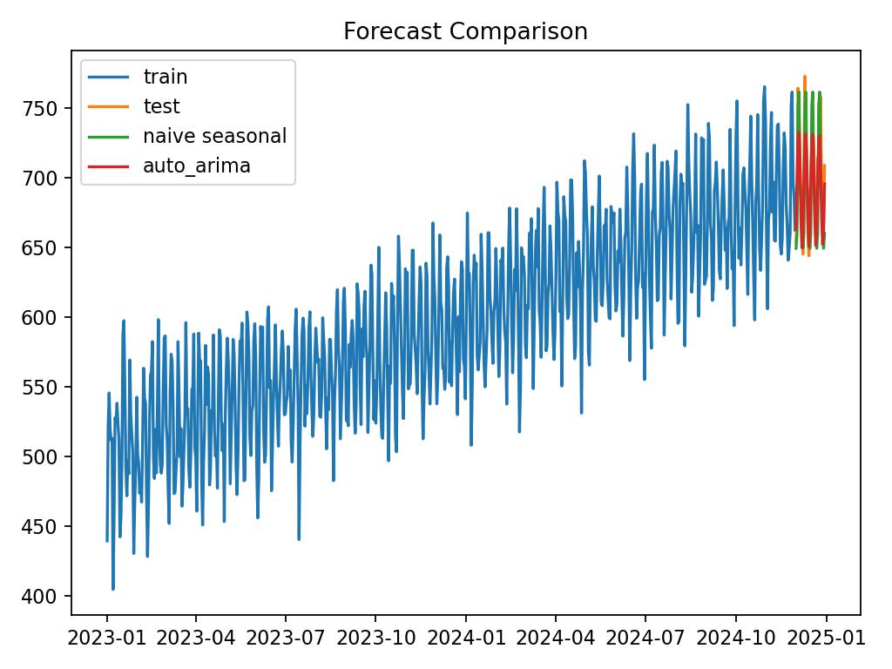
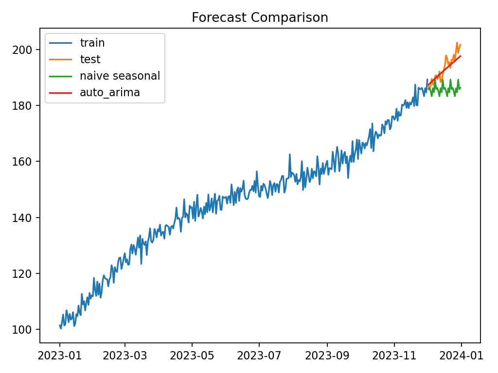

# Predictive Analytics Dashboard

End-to-end, reproducible time series forecasting pipeline with:
- EDA (exploratory analysis)
- Modeling (naive seasonal baseline, AutoARIMA)
- Evaluation (MAE/RMSE/MAPE)
- Interactive dashboard (Plotly HTML)
- Ready to run on **any CSV** with a date column and a numeric target

> This repo is designed to be recruiter-friendly and easy to demo. Drop in your dataset and run two commands.

## 1) Quickstart

```bash
# clone your repo locally (after you create it on GitHub)
git clone <YOUR_REPO_URL>
cd predictive-analytics-dashboard

# create venv & install deps
python -m venv .venv
source .venv/bin/activate  # on Windows: .venv\Scripts\activate
pip install -r requirements.txt

# Option A: run with the included sample dataset
python src/train_forecast.py

# Option B: run with your dataset
python src/train_forecast.py --csv data/your.csv --date-col DATE --target-col TARGET --freq D --horizon 30
```

Outputs:
- `results/metrics.json`
- `results/forecast_plot.png`
- `results/interactive_forecast.html` (open in a browser)
- `results/model_summary.txt`

## 2) Expected CSV Format

Your CSV needs **at least**:
- a date column (e.g., `date`)
- a numeric target column (e.g., `value`)

Example:

```
date,value
2024-01-01,123
2024-01-02,119
...
```

If your date format isn't ISO (YYYY-MM-DD), pass `--date-format` (e.g., `--date-format "%d/%m/%Y"`).

## 3) Re-running with a different dataset

Put your file in `data/` and run:

```bash
python src/train_forecast.py --csv data/your.csv --date-col <DATECOL> --target-col <TARGET> --freq D --horizon 30
```

Common frequencies:
- `D` daily
- `W` weekly
- `M` monthly
- `H` hourly

## 4) Notes

- The pipeline uses a **naive seasonal** baseline and **AutoARIMA** (via `pmdarima`) to keep installs light and reproducible.
- You can swap in `Prophet`/`NeuralProphet`/`statsmodels` SARIMAX later if you want to extend it.
- The interactive Plotly output is saved to `results/interactive_forecast.html` — great for portfolio demos.

### ISP Internet Traffic Dataset
This dataset simulates **daily ISP network traffic in Gbps** with an upward trend, weekly usage patterns, and random fluctuations.  
It represents how ISPs (like Bell) use forecasting for **capacity planning and network optimization**.



## Forecast Examples

### Synthetic Sample Dataset
This dataset is automatically included in the repo to demonstrate functionality.  
It simulates a simple trend with seasonality and noise.



---

**Author:** Gushan Gowressoo
